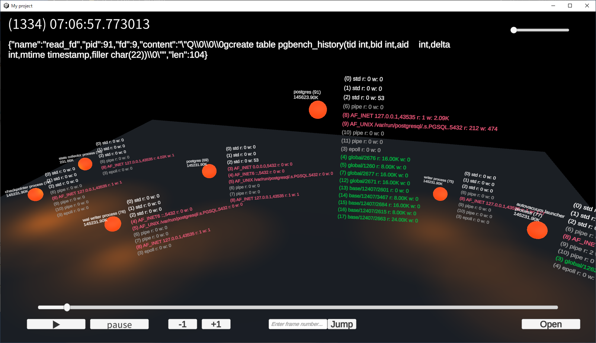

# viewer

straceログを変換したjsonlファイルのプレーヤー

## 操作
+ Openでjsonlファイルを開いて待つ
+ 右ボタンドラッグで視点回転
+ 中ボタンドラッグで視点移動
+ オレンジの球体を左ボタンドラッグで移動

## その他
+ プレーヤーサイズは1600x900前提
+ 最適化を行っていないので `../sample/pgbench.zip`(`pgbench.jsonl`)の再生にRAMを9GB使う
+ 作成時のUnityは2021.3.9f1
+ UnityStandaloneFileBrowser MIT License
  + https://github.com/gkngkc/UnityStandaloneFileBrowser/blob/master/LICENSE.txt
